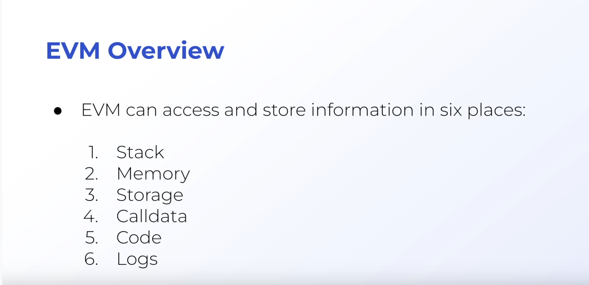

# EVM Overview

## Calldata, Memory and Storage

- For **calldata** and **memory**, the variable will only exist temporarily
- **Storage** variables exist even outside of just the function executing. So when you define a variable outside of a function, it defaults to a **storage** variable.
- One of the differences between *calldata* and *memory* is that if you choose **calldata** you can't modify the value of the variable inside the function. It's like a constant.
- Data location can also only be specified for **array**, **struct**, or **mapping** types. So if you are declaring an integer, for example, you don't need to specify the data location.
- Something interesting is that in solidity, a **string** is considered an *array* behind the scenes, and thus you need to specify the data location.
